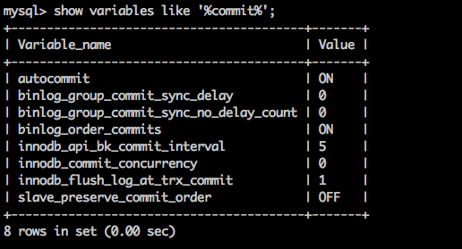
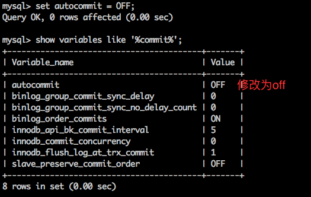

# ARTS
### leedcode402 - Remove K Digits
##### 题目:
 
 ```
 Given a non-negative integer num represented as a string, remove k digits from the number so that the new number is the smallest possible.

Note:
The length of num is less than 10002 and will be ≥ k.
The given num does not contain any leading zero.
Example 1:

Input: num = "1432219", k = 3
Output: "1219"
Explanation: Remove the three digits 4, 3, and 2 to form the new number 1219 which is the smallest.
Example 2:

Input: num = "10200", k = 1
Output: "200"
Explanation: Remove the leading 1 and the number is 200. Note that the output must not contain leading zeroes.
Example 3:

Input: num = "10", k = 2
Output: "0"
Explanation: Remove all the digits from the number and it is left with nothing which is 0.


 ```


- 实现思路是标准的贪心算法,如果 i 位数字比 i+1 位数字大,便可以去掉.

```
     class Solution {
public:
    string removeKdigits(string num, int k) {
        
 vector<int> S;
    string result = "";

    for (int i = 0; i < num.length(); ++i) {
        int number = num[i] - '0';

        while (S.size() && S[S.size() - 1]  > number  && k > 0) {
            S.pop_back();
            k--;
        }

        if(number !=0 || S.size()!= 0 )
        {
            S.push_back(number);
        }

    }


    while (S.size() != 0 && k> 0)
    {
        S.pop_back();
        k--;
    }

    for (int j = 0; j < S.size(); ++j) {
        result.append(1,'0' + S[j]);
    }

    if(result == "")
    {
        result = "0";
    }

    return result;

    }
};

```
   

##### 查看终端事物提交的模式 （默认是自动提交）
 
 ```
 show variables like '%commit%';

 ```
 
 

##### 修改终端事物提交的模式
 
 
 ```
 set autocommit = OFF;
 //查看修改之后的结果
 show variables like '%commit%';

 ```
 
 
 


### 事物的操作

* 开启事物

    >start transaction;
    
    
* 修改数据 

    >update test set name = 'transtion' where id = 1;
    
* 提交 or 回滚

    >commit； 提交事物，数据将会写进数据库
    >rollback; 数据回滚，数据回到设置之前的状态。
    
    
- 不关闭autocomit 依旧可以使用事物


### XML

```
<?xml version="1.0" encoding="utf-8" ?>
<stu>
    <name>shan</name>
    <age>18</age>
</stu>
```
  
  version 是版本，encoding 一般用utf-8编码。
  
#### XML解析

- 一般解析方式分为两种 DOM解析和SAX解析
- DOM
    > 一次性加载在在内存中
  
- SAX
    > 一次加载一部分到内存中
    
    ```
       jaxp  sun公司。 比较麻烦
		jdom
		dom4j  使用比较广泛
		
    ```
    
 ###Dom4j 基本用法

		element.element("stu") : 返回该元素下的第一个stu元素
		element.elements(); 返回该元素下的所有子元素。 

1. 创建SaxReader对象

2. 指定解析的xml

3. 获取根元素。

4. 根据根元素获取子元素或者下面的子孙元素


		try {
			//1. 创建sax读取对象
			SAXReader reader = new SAXReader(); //jdbc -- classloader
			//2. 指定解析的xml源
			Document  document  = reader.read(new File("src/xml/stus.xml"));
			
			//3. 得到元素、
			//得到根元素
			Element rootElement= document.getRootElement();
			
			//获取根元素下面的子元素 age
		//rootElement.element("age") 
			//System.out.println(rootElement.element("stu").element("age").getText());


			//获取根元素下面的所有子元素 。 stu元素
			List<Element> elements = rootElement.elements();
			//遍历所有的stu元素
			for (Element element : elements) {
				//获取stu元素下面的name元素
				String name = element.element("name").getText();
				String age = element.element("age").getText();
				String address = element.element("address").getText();
				System.out.println("name="+name+"==age+"+age+"==address="+address);
			}
			
		} catch (Exception e) {
			e.printStackTrace();
		}


SaxReader 创建好对象 。  

Document
Element

1. 看文档

2. 记住关键字 。

3. 有对象先点一下。

4. 看一下方法的返回值。 

5. 根据平时的积累。  getXXX setXXX 


### Dom4j 的 Xpath使用

>  dom4j里面支持Xpath的写法。 xpath其实是xml的路径语言，支持我们在解析xml的时候，能够快速的定位到具体的某一个元素。

1. 添加jar包依赖 

   jaxen-1.1-beta-6.jar

2. 在查找指定节点的时候，根据XPath语法规则来查找

3. 后续的代码与以前的解析代码一样。


			//要想使用Xpath， 还得添加支持的jar 获取的是第一个 只返回一个。 
			Element nameElement = (Element) rootElement.selectSingleNode("//name");
			System.out.println(nameElement.getText());


			System.out.println("----------------");

			//获取文档里面的所有name元素 
			List<Element> list = rootElement.selectNodes("//name");
			for (Element element : list) {
				System.out.println(element.getText());
			}


### XML 约束【了解】

如下的文档， 属性的ID值是一样的。 这在生活中是不可能出现的。 并且第二个学生的姓名有好几个。 一般也很少。那么怎么规定ID的值唯一， 或者是元素只能出现一次，不能出现多次？ 甚至是规定里面只能出现具体的元素名字。 

		<stus>
			<stu id="10086">
				<name>张三</name>
				<age>18</age>
				<address>深圳</address>
			</stu>
			<stu id="10086">
				<name>李四</name>
				<name>李五</name>
				<name>李六</name>
				<age>28</age>
				<address>北京</address>
			</stu>
		</stus>

### DTD

	语法自成一派， 早起就出现的。 可读性比较差。 

1. 引入网络上的DTD

   	<!-- 引入dtd 来约束这个xml -->

   	<!--    文档类型  根标签名字 网络上的dtd   dtd的名称   dtd的路径
   	<!DOCTYPE stus PUBLIC "//UNKNOWN/" "unknown.dtd"> -->

   2. 引入本地的DTD

      <!-- 引入本地的DTD  ： 根标签名字 引入本地的DTD  dtd的位置 -->
      <!-- <!DOCTYPE stus SYSTEM "stus.dtd"> -->

2. 直接在XML里面嵌入DTD的约束规则

   	<!-- xml文档里面直接嵌入DTD的约束法则 -->
   	<!DOCTYPE stus [
   		<!ELEMENT stus (stu)>
   		<!ELEMENT stu (name,age)>
   		<!ELEMENT name (#PCDATA)>
   		<!ELEMENT age (#PCDATA)>
   	]>
   	
   	<stus>
   		<stu>
   			<name>张三</name>
   			<age>18</age>
   		</stu>
   	</stus>


		<!ELEMENT stus (stu)>  : stus 下面有一个元素 stu  ， 但是只有一个
		<!ELEMENT stu (name , age)>  stu下面有两个元素 name  ,age  顺序必须name-age
		<!ELEMENT name (#PCDATA)> 
		<!ELEMENT age (#PCDATA)>
		<!ATTLIST stu id CDATA #IMPLIED> stu有一个属性 文本类型， 该属性可有可无


		元素的个数：

			＋　一个或多个
			*  零个或多个
			? 零个或一个
	
		属性的类型定义 
	
			CDATA : 属性是普通文字
			ID : 属性的值必须唯一


		<!ELEMENT stu (name , age)>		按照顺序来 

		<!ELEMENT stu (name | age)>   两个中只能包含一个子元素
### Schema

	其实就是一个xml ， 使用xml的语法规则， xml解析器解析起来比较方便 ， 是为了替代DTD 。
	但是Schema 约束文本内容比DTD的内容还要多。 所以目前也没有真正意义上的替代DTD


	约束文档：
		<!-- xmlns  :  xml namespace : 名称空间 /  命名空间
		targetNamespace :  目标名称空间 。 下面定义的那些元素都与这个名称空间绑定上。 
		elementFormDefault ： 元素的格式化情况。  -->
		<schema xmlns="http://www.w3.org/2001/XMLSchema" 
			targetNamespace="http://www.itheima.com/teacher" 
			elementFormDefault="qualified">
			
			<element name="teachers">
				<complexType>
					<sequence maxOccurs="unbounded">
						<!-- 这是一个复杂元素 -->
						<element name="teacher">
							<complexType>
								<sequence>
									<!-- 以下两个是简单元素 -->
									<element name="name" type="string"></element>
									<element name="age" type="int"></element>
								</sequence>
							</complexType>
						</element>
					</sequence>
				</complexType>
			</element>
		</schema>
	
	实例文档：
		<?xml version="1.0" encoding="UTF-8"?>
		<!-- xmlns:xsi : 这里必须是这样的写法，也就是这个值已经固定了。
		xmlns : 这里是名称空间，也固定了，写的是schema里面的顶部目标名称空间
		xsi:schemaLocation : 有两段： 前半段是名称空间，也是目标空间的值 ， 后面是约束文档的路径。
		 -->
		<teachers
			xmlns:xsi="http://www.w3.org/2001/XMLSchema-instance"
			xmlns="http://www.itheima.com/teacher"
			xsi:schemaLocation="http://www.itheima.com/teacher teacher.xsd"
		>
			<teacher>
				<name>zhangsan</name>
				<age>19</age>
			</teacher>
			<teacher>
				<name>lisi</name>
				<age>29</age>
			</teacher>
			<teacher>
				<name>lisi</name>
				<age>29</age>
			</teacher>
		</teachers>

### 名称空间的作用

一个xml如果想指定它的约束规则， 假设使用的是DTD ，那么这个xml只能指定一个DTD  ，  不能指定多个DTD 。 但是如果一个xml的约束是定义在schema里面，并且是多个schema，那么是可以的。简单的说： 一个xml 可以引用多个schema约束。 但是只能引用一个DTD约束。

名称空间的作用就是在 写元素的时候，可以指定该元素使用的是哪一套约束规则。  默认情况下 ，如果只有一套规则，那么都可以这么写

	<name>张三</name>

	<aa:name></aa:name>
	<bb:name></bb:name>


#### 思考总结
最近一段时间学习后端知识,从基础学起,认识到自己英语不好,很多学习需要配合视频来看,认识到这个学习过程是不太正确的,所以以后要提高英语水平,掌握一手资源,更快更高效的学习.