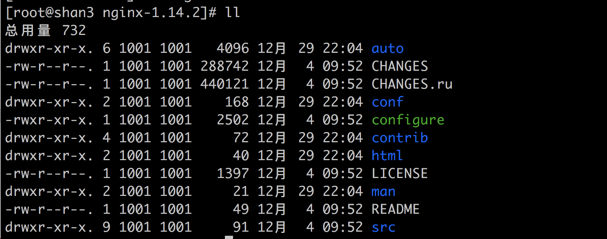
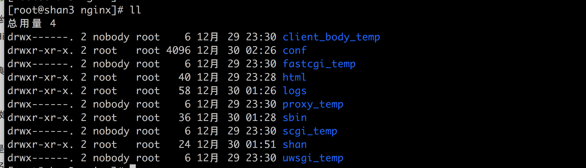
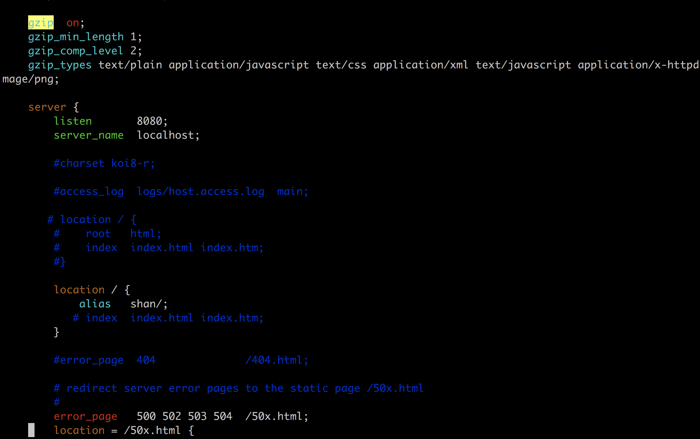

# ARTS
 
### leedcode78 - Subsets
##### 题目:
 
 ``` 
 Given a set of distinct integers, nums, return all possible subsets (the power set).

Note: The solution set must not contain duplicate subsets.

Example:

Input: nums = [1,2,3]
Output:
[
  [3],
  [1],
  [2],
  [1,2,3],
  [1,3],
  [2,3],
  [1,2],
  []
]

 ```


> 位运算操作,一个元素可以选择放入不放入.如果4个元素那就是那就2^4 = 16种 ,二进制边是(0000,0001,0010,0011,0100,0101,0110,0111,1000,1001,1010,1011,1100,1101,1110,1111)<br>
> 1是放入,0不放入.正好16种方式

```
 class Solution {
public:
    vector<vector<int>> subsets(vector<int>& nums) {
         
         int all_set = 1<<nums.size();

    vector<vector<int>> result;

    for (int i = 0; i < all_set; ++i) {

        vector<int> item;
        for (int j = 0; j < nums.size(); ++j) {

            if(i & (1<<j))
            {
                item.push_back(nums[j]);
            }

        }

        result.push_back(item);
    }

    return result;
        
    }
};

```


### nginx 安装和配置

##### 1.下载nginx

  1. http://nginx.org 点击 download
  2. 拷贝 连接 http://nginx.org/download/nginx-1.14.2.tar.gz
  3. 在服务器中下载nginx  
      
      ```
     wget  http://nginx.org/download/nginx-1.14.2.tar.gz
       
      ```
      
  4. 出现 -bash: wget: 未找到命令
      
      ```
       安装 wget 
       
       yum install wget
      ``` 
 
   5. 解压文件
       
       ```
       tar -zxvf nginx-1.14.2.tar.gz
       
       ```
       
       
##### 2.各目录介绍 



1. auto
   
   ```
   cc 用于编译
   lib 函数库
   os 对于操作系统的判断
   其他文件目录为了配合 configure 编译
   
   ```
   
2. CHANGES
    
    ```
    每个版本提供了哪些特性和修复哪些bug
    
    ```
    
    
3. conf
   
   ```
   事例文件,为了配合运维同学
   ```
   
4. configure
    
    ```
    编译前的配置脚本
    ```

5. contrip
   
   ```
   vim 显示
   
   
   ```
   
   ```
   cd conf
   vim nginx.conf

   -bash: vim: 未找到命令
   解决: 
   yum install vim
   
   cp -r contrib/vim/* ~/.vim/
   
   -r contrib/vim/* ~/.vim/
   解决
   mkdir ~/.vim
   
   vim /conf/nginx.conf  
   显示 vim 语法了
   
   ```
   
6. index 
   	- 主页 和 500错误的 html
   	
7. man
   - nginx 帮助文件
   
8. src
   - nginx 源代码
   

##### 3.Configure

 1. 查看帮助文档
    
    ```
    ./configure --help | more
    
    ```
    
    正常只需指定 --prefix
    
##### 4.中间文件介绍

- ./configure --prefix=/usr/local/src/nginx

  ```
 	配置
    ./configure --prefix=/usr/local/src/nginx
    
    checking for C compiler ... not found
    解决:安装c c++
      yum install gcc
      yum install gcc-c++ libstdc++-devel
      
      
     ./configure: error: the HTTP rewrite module requires the PCRE library.
     解决:
     yum -y install pcre-devel openssl openssl-devel
     
     再次
     ./configure --prefix=/usr/local/src/nginx

  ```

##### 5.编译

```
    - make
```


##### 6.安装

```
 安装 (首次安装可以使用)
     make install
         
```


##### 7.启动和停止
```
     进入nginx目录
     
     cd /usr/local/src/nginx/sbin
     
     ./nginx
     
     关闭防火墙
     systemctl stop firewalld.service
     
     输入ip 显示主页
     
     
     优雅停止:
     ./nginx -s quit
     
     强制停止:
     ./nginx -s stop
     
     重启:
     ./nginx -s reload
     
  
```


#### 重载配置文件

  ```
  修改 nginx.conf 中的 tcp_nopush  on 
   
   重载配置文件
   ./nginx -s reload
  
  ```

#### 配置简单静态服务器

在 nginx 目录下创建 shan  mkdir shan

  
  
配置

vim conf/nginx.conf

```
    gzip  on;
    gzip_min_length 1;
    gzip_comp_level 2;
    gzip_types text/plain application/javascript text/css application/xml text/javascript application/x-httpd-php image/jpeg image/gif image/png;
    
    
       location / {
            alias   shan/;
           # index  index.html index.htm;
        }
        
```

 


重新加载服务 <br>
 ./sbin/nginx -s reload
 
 
 http://192.168.56.103:8080/index.html
 
 使用GZIP 压缩可以减少传输的内容
 
 
 
##### 总结
 每个出现的问题要多问,问什么会这样,什么原因导致的,找的问题的本质,更好的理解和解决问题.
 
 
 
   


